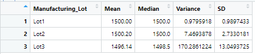

# MechaCar_Statistical_Analysis

## Overview of the analysis
AutosRUs’ newest prototype, the MechaCar, is suffering from production troubles that are blocking the manufacturing team’s progress. AutosRUs’ upper management has called on the data analytics team to review the production data for insights that may help the manufacturing team.<br />

The technical analysis deliverables required to complete the MechaCar_Statistical analysis include: <br />

1. Linear Regression to Predict MPG.
2. Summary Statistics on Suspension Coils.
3. T-Test on Suspension Coils.
4. Design a Study Comparing the MechaCar to the Competition.

## Resources
- Data Source: This analysis was performed using the  [MechaCar MPG](https://github.com/aobasuyi/MechaCar_Statistical_Analysis/blob/main/Analysis/MechaCar_mpg.csv) and [Suspension Coil](https://github.com/aobasuyi/MechaCar_Statistical_Analysis/blob/main/Analysis/Suspension_Coil.csv) datasets.
-  Code: [MechaCarChallenge.R](https://github.com/aobasuyi/MechaCar_Statistical_Analysis/blob/main/Analysis/MechaCarChallenge.R) 
- Software: R 4.1.0 and RStudio Desktop 1.4.1717

## A. Linear Regression to Predict MPG:
-  Using your knowledge of R, design a linear model that predicts the mpg of MechaCar prototypes using several variables from the MechaCar MPG data. <br />
##### Code:
```
#Import MechaCar dataset
MpgCar <- read.csv(file='MechaCar_mpg.csv',check.names=F,stringsAsFactors = F)

#Generate multiple linear regression model
lm(mpg ~ vehicle_length + vehicle_weight + spoiler_angle + ground_clearance + AWD,data=MpgCar) 

#Generate summary statistics
summary(lm(mpg ~ vehicle_length + vehicle_weight + spoiler_angle + ground_clearance + AWD,data=MpgCar))

```
##### Result:
i.) Multiple linear regression analysis:<br />
<br />  <br />

- According to the result above, vehicle length and ground clearance (as well as intercept) are statistically unlikely to provide random amounts of variance to the linear mode. This means that vehicle length and ground clearance have significant impact on mpg values of MechaCar prototypes. A significant intercept could mean that the significant features (such as vehicle length and ground clearance) may need scaling or transforming to help improve the predictive power of the model.

- The p-value of the linear regression analysis (*p* = 5.35e-11) is much smaller than our assumed significance level of 0.05%. Therefore, we can state that there is sufficient evidence to reject our null hypothesis, which means that the slope of our linear model is not zero.

 - The r-squared value of our linear regression model is 0.72, which means that roughly 70% of the variablilty of our dependent variable (mpg predictions) is explained using this linear model. The r-squared value shows the model has the ability to strongly predict future mpg observations 70% while the p-value remained significant.

ii.) Correlation matrix:<br />
<br />  <br />

 - The correlation matrix result shows that vehicle length has strong positive correlation; ground clearance, weak positive correlation and AWD, very weak negative correlation with mpg values respectively. The strong correlations between some of the independent variables and our dependent variable may have improved the performance of our model, however, lack of significant variables may also be evidence of overfitting.
 
 ## B. Summary Statistics on Suspension Coils:
- Using your knowledge of R, create a summary statistics table to show:
    - The suspension coil’s PSI continuous variable across all manufacturing lots
    - The following PSI metrics for each lot: mean, median, variance, and standard deviation.
##### Code:
```
#Import Suspension_Coil dataset
SCoil <- read.csv(file='Suspension_Coil.csv',check.names=F,stringsAsFactors = F)

#Create summary table with multiple columns
summarize_Scoil <- SCoil%>%summarize(Mean=mean(PSI), Median=median(PSI), Variance=var(PSI), SD= sd(PSI), .groups = 'keep') 
#Create summary table with multiple columns
summarize_Scoil2 <- SCoil %>% group_by(Manufacturing_Lot)%>%summarize(Mean=mean(PSI), Median=median(PSI), Variance=var(PSI), SD= sd(PSI), .groups = 'keep') 

```
##### Results:
<br />  <br />
- The design specifications for the MechaCar suspension coils dictate that the variance of the suspension coils must not exceed 100 pounds per square inch. The result above shows that the variance of the suspension coils for all manufactuing Lots (*var* = 62.30) meets MechaCar design specifications. 

<br />  <br />
- According to the result above, the variance of the suspension coils for manufactuing Lots3, (*var* = 170.29) exceeds 100 pounds per square inch. This means that the current manufacturing data for Lots1 and Lots2 met the MechaCar design specification while the manufacturing data for Lots3 did not meet MechaCar design specification.

## C. T-Tests on Suspension Coils: 
- Using your knowledge of R, perform t-tests determine if all manufacturing lots and each lot individually are statistically different from the population mean of 1,500 pounds per square inch

##### Code:

```
# Test statistically different from the miles driven in sample vs population data
t.test(SCoil$PSI, mu=1500) #compare sample versus population means

filter_SCoil1 <- subset(SCoil, Manufacturing_Lot == "Lot1") #filter by Lot1
filter_SCoil2 <- subset(SCoil, Manufacturing_Lot == "Lot2") #filter by Lot2
filter_SCoil3 <- subset(SCoil, Manufacturing_Lot == "Lot3") #filter by Lot2

```
##### Result:

<br />  <br />

- The result above shows that the *p*-value = 0.06028 is above our significance level of 0.05 percent. We do not have sufficient evidence to reject the null hypothesis, and would state that the two means are statistically similar.

<br />  <br />

- The *p*-value = 1 is above our significance level of 0.05 percent. We do not have sufficient evidence to reject the null hypothesis, and we would state that the two means are statistically similar.

<br />  <br />

- The result above shows that the *p*-value = 0.6072 is above our significance level of 0.05 percent. We do not have sufficient evidence to reject the null hypothesis, and would state that the two means are statistically similar.

<br />  <br />

- The result above shows that the *p*-value = 0.04168 is below our significance level of 0.05 percent. We would therefore, reject the null hypothesis, and state that the two means are  not statistically similar..


## D. Study Design: MechaCar vs Competition

- Using your knowledge of R, design a statistical study to compare performance of the MechaCar vehicles against performance of vehicles from other manufacturers.

a.) Write a short description of a statistical study that can quantify how the MechaCar performs against the competition. In your study design, think critically about what metrics would be of interest to a consumer: for a few examples, cost, city or highway fuel efficiency, horse power, maintenance cost, or safety rating.

b.) In your description, address the following questions:
What metric or metrics are you going to test?
What is the null hypothesis or alternative hypothesis?
What statistical test would you use to test the hypothesis? And why?
What data is needed to run the statistical test?-

<br /><br />

f we want to verify that a car battery ages at an appropriate rate, we would need to test our question with a regression model. If we were to use a multiple linear regression model, we would need to collect numerical variables, such as number of uses, time, battery capacity, tire tread, and engine horsepower.

a.) Metric to be tested: 
- To verify the maintenance cost of MechaCar compared against the competition.

b.) The null hypothesis or alternative hypothesis:


H0 : The slope of the linear model is zero, or m = 0

Ha : The slope of the linear model is not zero, or m ≠ 0

If there is no significant linear relationship, each dependent value would be determined by random chance and error. Therefore, our linear model would be a flat line with a slope of 0.

c.) Statistical test to test the hypothesis:
- A multiple linear regression which uses multiple independent variables to account for parts of the total variance observed in the dependent variable.
- How much variance in the maintenance cost is accounted for in a linear combination of independent variables such as mileage, highway fuel efficiency (mpg), engine horse power, vehicle weight and number of uses, ?

d.) Data is needed to run the statistical test:
- The data to collect - 2 years maintenance costs for 40 MechaCars and 40 competiton brands collected from Services department and from study participants questionaire
